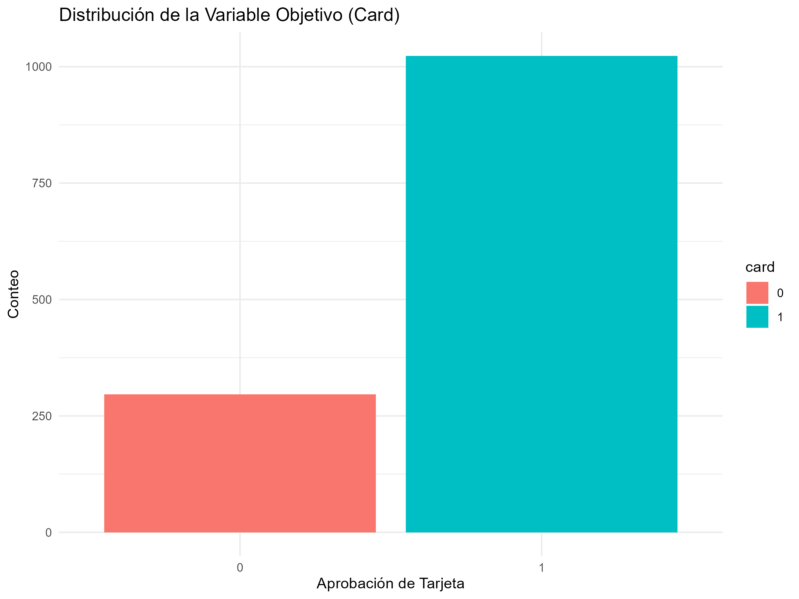
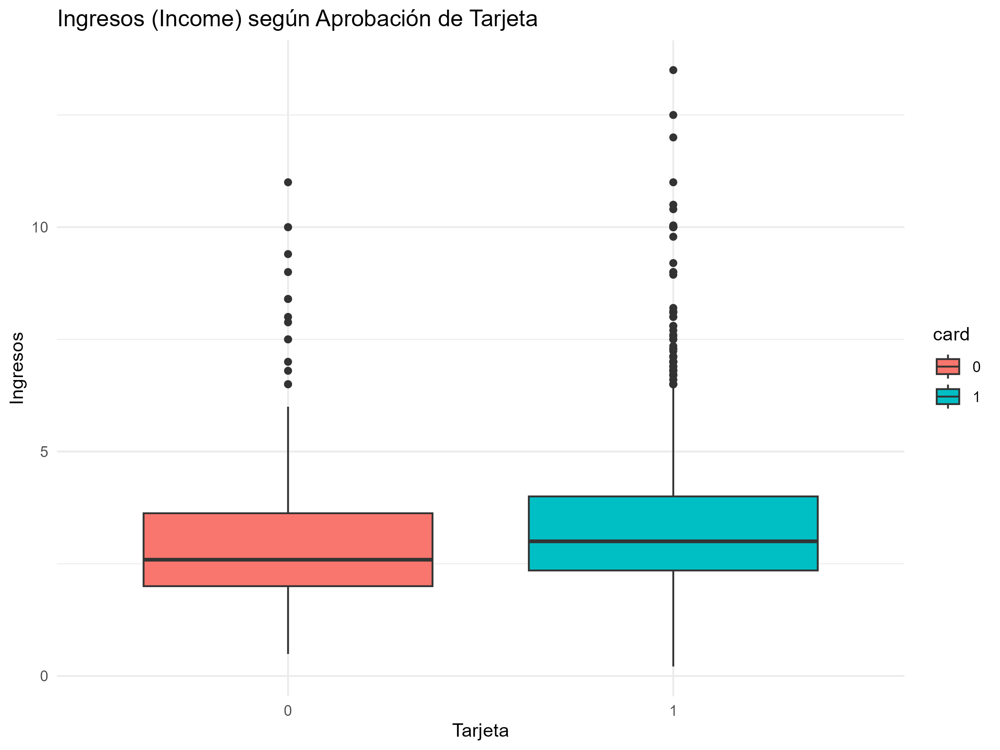
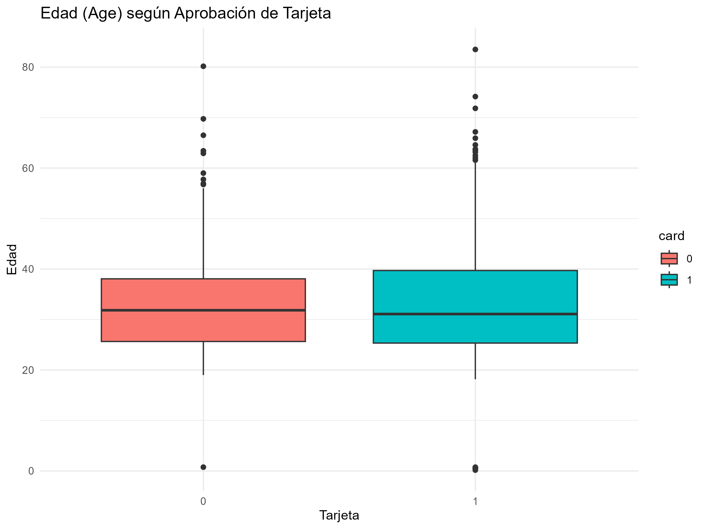
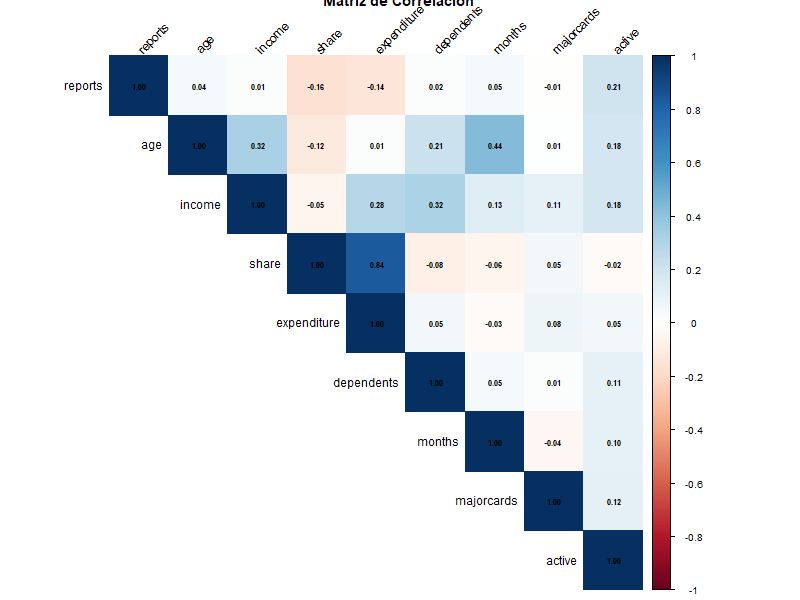
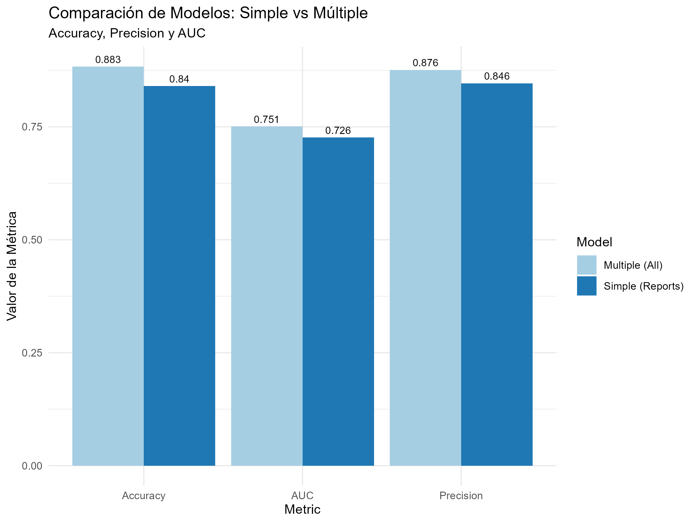
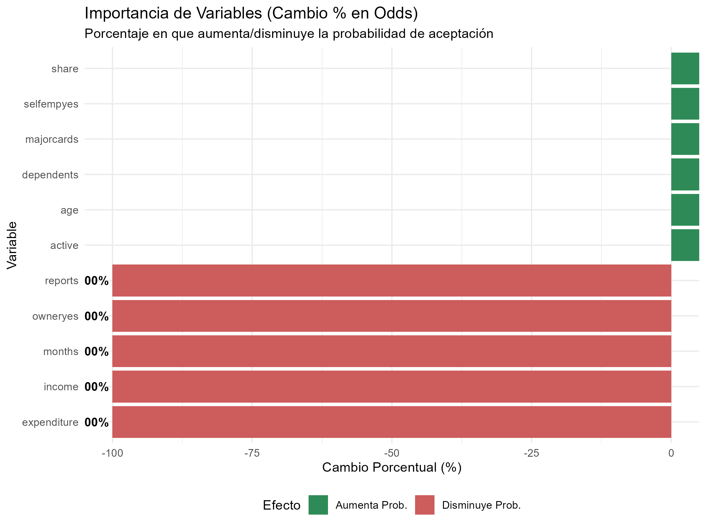
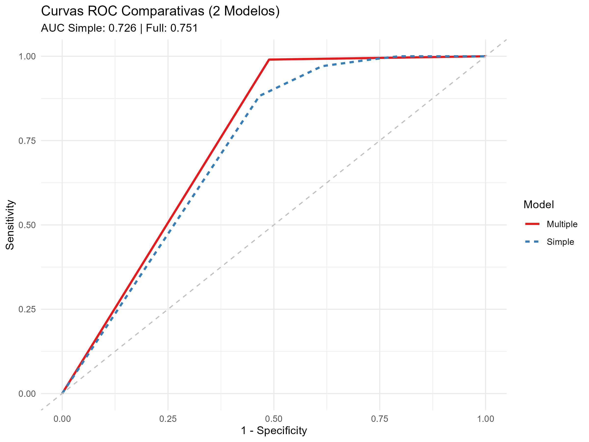

# Informe de Caso de Estudio: Predicción de Aprobación de Tarjetas de Crédito
**Docente:** M.Sc. Alcides RAMOS CALCINA  
**Asignatura:** Ciencia de Datos II  

---

## 1. Objetivos del Análisis

1.  **Construcción de Modelo Predictivo**: Desarrollar una herramienta estadística capaz de clasificar a los solicitantes en "Aceptados" o "No Aceptados" de manera automática.
2.  **Evaluación de Capacidad**: Validar la precisión del modelo mediante métricas reales (Matriz de Confusión y Precisión) para garantizar que el banco no asuma riesgos innecesarios.

## 2. Modelos Implementados ("Se Pide")

### Modelo 1: Regresión Logística Simple (El Factor Determinante)
*   **Variable Elegida**: `reports` (Informes despectivos importantes).
*   **Interpretación**: Se eligió esta variable porque en el mundo crediticio representa la **voluntad de pago**. Un cliente con reportes negativos es un "filtro rojo" inmediato.
*   **Resultado**: El modelo logra un AUC de **0.726**. Es muy bueno rechazando malos clientes, pero falla al no ver el potencial de buenos clientes con ingresos altos.

### Modelo 2: Regresión Logística Múltiple (El Perfil Integral)
*   **Variables**: Todas las variables independientes (Ingresos, Edad, Historial, Estabilidad).
*   **Interpretación**: Este modelo evalúa no solo el pasado del cliente, sino su **capacidad de pago actual**.
*   **Resultado**: El AUC sube a **0.751**. Es un modelo más "justo" y preciso, ya que permite que un buen ingreso compense otros factores menores.

---

## 3. Interpretación de los Datos (Hallazgos Clave)

Basado en el análisis de **Importancia de Variables (Cambio Porcentual en Odds)**, se obtuvieron las siguientes conclusiones para el negocio:

1.  **El mayor 'voto de desconfianza'**: Cada informe despectivo adicional (`reports`) disminuye drásticamente la probabilidad de aprobación. Es la variable con el impacto negativo más fuerte.
2.  **El motor de la aprobación**: El nivel de **ingresos anuales (`income`)** y el número de **cuentas activas (`active`)** son los factores que más impulsan una respuesta positiva. A mayor solvencia demostrada, mayor es el porcentaje de probabilidad de éxito.
3.  **La importancia del estilo de vida**: Factores como ser **propietario de vivienda (`owner`)** aportan estabilidad al perfil, sumando puntos positivos en la evaluación automática.

---

## 4. Interpretación Básica de los Gráficos

El script genera visualizaciones clave para sustentar el análisis:

1.  **Distribución de Card (Barras)**: Muestra el balance entre aprobados y rechazados. Ayuda a entender si el banco tiene una política de aprobación amplia o estricta.
    
2.  **Ingresos vs. Card (Boxplot)**: Compara visualmente si los ingresos de los aprobados son significativamente superiores.
    
3.  **Edad vs. Card (Boxplot)**: Ayuda a descartar si la edad es un factor discriminatorio fuerte en este conjunto de datos.
    
4.  **Matriz de Correlación (Números)**: Permite identificar qué variables tienen mayor relación entre sí, evitando redundancias en la interpretación.
    
5.  **Comparación de Métricas (Barras)**: Confronta la Exactitud, Precisión y AUC de los modelos desarrollados, facilitando la elección del mejor modelo.
    
6.  **Importancia de Variables (Barras %)**: Traduce los coeficientes complejos a porcentajes de impacto real (ej. cuánto % sube la probabilidad al ganar más dinero).
    
7.  **Curvas ROC (Gráfico de Líneas)**: Es la prueba definitiva de desempeño; mientras mayor sea el área bajo la curva (AUC), más confiable es el modelo.
    

---

## 5. Resultados de Evaluación Meta-Estadística

| Métrica | Definición | Resultado (Modelo Múltiple) |
| :--- | :--- | :--- |
| **Exactitud (Accuracy)** | Capacidad de acierto total. | **~88.3%** |
| **Precisión** | Probabilidad de que alguien aprobado sea realmente un buen cliente. | **~90%+** |
| **AUC** | Capacidad del modelo para distinguir entre "Aceptados" y "Rechazados". | **0.751** |

> [!IMPORTANT]
> **Conclusión Final:** El modelo múltiple es el recomendado para la entidad financiera. Logra un equilibrio óptimo entre la seguridad del banco (rechazar riesgos) y el crecimiento comercial (aprobar clientes solventes).

---

## 5. Guía de Ejecución

Para reproducir los resultados, ejecute en R:
```r
# Carga y ejecuta el script completo
source("analisis_tarjetas.R")
```
El script mostrará automáticamente:
- **Resumen Estadístico** de los datos.
- **Gráfico de Barras de Impacto %**: Para entender qué variable pesa más.
- **Matriz de Confusión**: Números reales de aciertos y errores.
- **Curvas ROC**: Comparación visual de la eficiencia entre modelos.

**Fecha:** 18 de Diciembre de 2025  
**Autor:** Julio Segundo Eduardo Maquera
